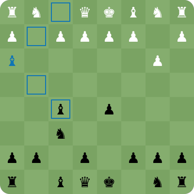
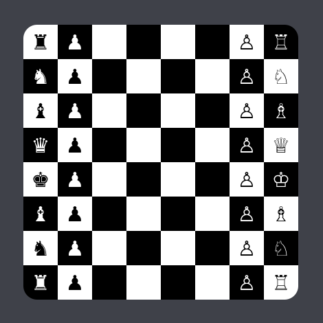

# Gameboard

Gameboards built in a playground

- [x] Swift Player Per Turn
- [ ] Piece Collection
- [ ] Simple Move AI

#### Overall Validation

- [x] Stop friendly fire : *checks if target piece is yours*
- [x] Only play on your turn : *checks against pieces for player*
- [x] No piece available : *checks for no piece*
- [x] Off the board : *checks if target square is on board*

## Chess

#### Validation

- [x] Pawn
- [ ] Rook ~
- [ ] Knight ~
- [ ] Bishop ~
- [ ] Queen ~
- [x] King

~ *needs to check path*

## Checkers

#### Validation

- [x] Diagonal -> 1
- [ ] Diagonal Jump
- [ ] Multiple Jumps